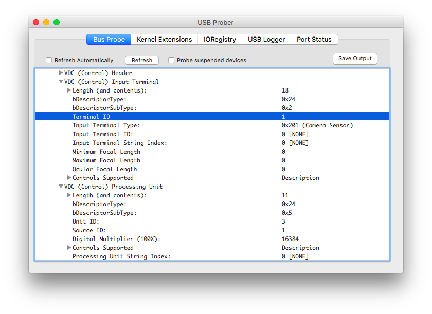

#uvc-control

Control a USB Video Class compliant webcam from node. Most modern USB webcams use a common set of controls standardized by the USB Implementers Forum. You can use this set of controls to change certain things on the camera, such as the brightness, contrast, zoom level, focus and so on.

## Example

```javascript
var UVCControl = require('uvc-control');

var camera = new UVCControl(0x046d, 0x082d);

camera.get('autoFocus', function(error,value) {
	console.log('AutoFocus setting:', value);
});

camera.set('brightness', 100, function(error) {
	if (!error) {
		console.log('Brightness Set OK!');
	}
});

```

## Finding Your vendorId / productId

Every USB device has a vendorId and productId. You can use Device Manager (Windows), System Information (Mac) or lsusb (Linux) to find these, or you can use the list-devices.js in this repo to find the right paramters.

```
$ node list-devices.js
HD Pro Webcam C920 [ vid: 0x46d  / pid: 0x82d  ]
Bluetooth USB Host Controller [ vid: 0x5ac  / pid: 0x828f  ]
BRCM20702 Hub [ vid: 0xa5c  / pid: 0x4500  ]
```

## Installation

Libusb is included as a submodule. On Linux, you'll need libudev to build libusb. On Ubuntu/Debian: `sudo apt-get install build-essential libudev-dev`

Then, just run

```
npm install uvc-control
```


## API

```javascript
var UVCControl = require('uvc-control');
```

### UVCControl.controls

An array of support controls.

```javascript
UVCControl.controls.forEach(function(name) {
  console.log(name);
})
```

### new UVCControl(vendorId, productId, options)

* **vendorId** - numeric vendor id of your device (see above)
* **productId** - numeric product id of your device (see above)
* **options** - object containing options
* **options.inputTerminalId** - override input terminal id if not 0x01
* **options.processingUnitId** - override processing unit id if not 0x03

```javaScript
var camera = new UVCControl(0x046d, 0x082d);
```

#### Note on inputTerminalId / processingUnitId:

These are values that should be able to be autodetected for a UVC compliant camera, but I'm not sure how to do this yet. Mine are 0x01 and 0x03, but I have seen it as 0x01 and 0x02 for the QuickCam 9000. If you get an error like `{ [Error: LIBUSB_TRANSFER_STALL] errno: 4 }` you may need to change this setting.

```javascript
// Set up QuickCam 9000
var camera = new UVCControl(0x046d, 0x082d, {
	processingUnitId: 0x02
});
```

You can find out your setting by using something like `USB Prober` for OSX:



This should be a temporary workaround. Ideas for how to autodetect the proper id's are welcome!

### camera.get( controlName, callback )

Get the current value of the specified control by name.

```javascript
camera.get('sharpness', function(error, value) {
	if (error) return console.log(error);
	console.log('Sharpness is', value);
});
```

### camera.range( controlName, callback )

Get the min and max value of the specified control by name. Some controls do not support this method.

```javascript
camera.range('absoluteFocus', function(error, range) {
	if (error) return console.log(error);
	console.log(range); // [ 0, 250 ]
});
```

### camera.set( controlName, value, callback )

Get the current value of the specified control by name.

```javascript
camera.set('saturation', 100, function(error) {
	if (error) return console.log(error);
	console.log('Saturation set!');
});
```
#### autoExposureMode
`autoExposureMode` is a bitmask and expects one of the following values:

* manual: `0b00000001` (1)
* auto: `0b00000010` (2)
* shutter priority: `0b00000100` (4)
* aperture priority: `0b00001000` (8)

#### autoExposurePriority

`autoExposurePriority` is used to specify constraints on `absoluteExposureTime` when `autoExposureMode` is set to `auto` or `shutter priority`. A value of 0 means that the frame rate must remain constant. A value of 1 indicates that the frame rate may be dynamically varied by the device.

### camera.setRaw( controlName, buffer, callback )

Some controls do not except numbers. This is a workaround so you can give them what they need. The odd one so far is `absolutePanTilt`, which expects a buffer of two 4 byte numbers:


```javascript
var pan = 34;
var tilt = 27;
var buffer = new Buffer(8);
buffer.writeIntLE(pan, 0,4);
buffer.writeIntLE(tilt, 4,4);
camera.setRaw('absolutePanTilt', buffer, function(error) {
	if (error) return console.log(error);
	console.log('Saturation set!');
});
```

### camera.close()

Done? Good. Put away your toys and release the USB device.

```javascript
camera.close();
```

## Currently Supported Controls

* autoExposureMode
* autoExposurePriority
* absoluteExposureTime
* absoluteFocus
* absoluteZoom
* absolutePanTilt
* autoFocus
* brightness
* contrast
* saturation
* sharpness
* whiteBalanceTemperature
* backlightCompensation
* gain
* autoWhiteBalance

### Note:

This library was written with a Logitech C920 camera in mind. While it should work with any UVC complient webcam, I didn't implement things that weren't supported by my camera. You can find the full list of specs at the USB Implmentors Forum. Look for a document called *USB Device Class Definition for Video Devices Revision 1.1* at their site here: [http://www.usb.org/developers/docs/devclass_docs/](http://www.usb.org/developers/docs/devclass_docs/)

Pull requests and testers welcome!

### Credits

Written by [Pawel Szymczykowski](http://twitter.com/makenai) and based on some Objective C examples by [Dominic Szablewski](https://twitter.com/phoboslab) found at [http://phoboslab.org/log/2009/07/uvc-camera-control-for-mac-os-x](http://phoboslab.org/log/2009/07/uvc-camera-control-for-mac-os-x).
